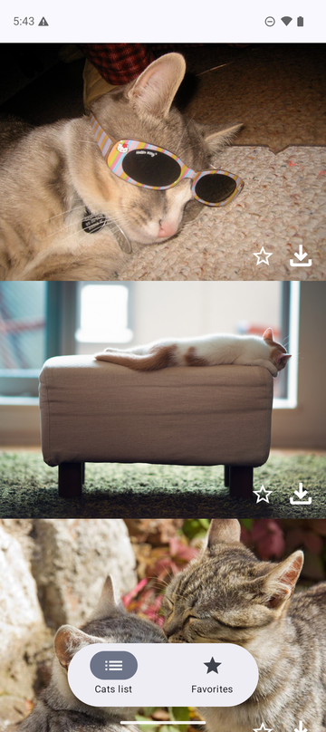
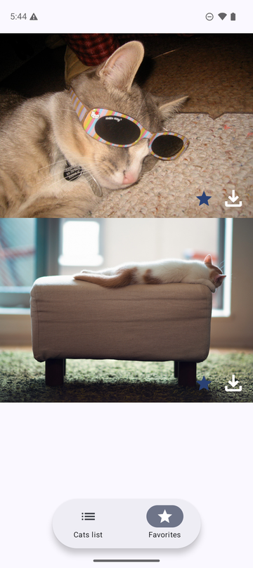

# CatsList

[](https://github.com/romanmahachkala05/CatsListApplication/actions/workflows/ci.yml)

An endless feed of cats from [TheCatAPI](https://developers.thecatapi.com/), with
favorites kept in Room and one-tap image download.

Originally written in 2022 with XML views, `AsyncTask`-era patterns and a
`fallbackToDestructiveMigration()` database. Rebuilt incrementally — Compose,
Clean Architecture, MVI, Navigation 3, Hilt, real migrations — one reviewable
pull request at a time, with the build green at every commit.

| Feed | Favorites | Failure and recovery |
| --- | --- | --- |
|  |  |  |

---

## Architecture

Single module, Clean Architecture, one direction of dependency:

```
presentation  ──►  domain  ◄──  data
```

`domain` knows nothing about Android — no SDK, no Compose, no Room, no Hilt.
`data` implements interfaces that `domain` declares. `presentation` never
touches a repository or the database directly.

Every screen is the same six pieces: an immutable `State` with one sealed
`UiStatus` (never boolean flags), an `Event` type, a `StateHolder` that is the
only thing allowed to mutate state, an `ErrorHandler`, a ViewModel that merely
orchestrates, and a stateless `Content` composable the previews render.

Single module is a decision with a stated trigger for splitting, not an
oversight — see [ADR-0001](docs/DECISIONS.md#adr-0001).

## Built with

| | |
| --- | --- |
| UI | Jetpack Compose, Material 3, Coil |
| Navigation | Navigation 3 (`NavDisplay`, typed `NavKey`s) |
| DI | Hilt |
| Async | Coroutines, Flow |
| Network | Retrofit |
| Storage | Room, with real migrations and committed schemas |
| Build | Gradle KTS, version catalog, KSP, JDK 17 |
| Tests | JUnit4, Truth, `kotlinx-coroutines-test`, hand-written fakes |

## Tests

**78 unit tests, 11 instrumented.** No mocking library — every test double is a
real in-memory implementation ([ADR-0012](docs/DECISIONS.md#adr-0012)).

The instrumented ones are not optional extras. They are the only place three
data-loss failures can be checked, because all three are Room behaviour that no
JVM fake reproduces: that `@Transaction` really serializes concurrent writes,
that `MIGRATION_2_3` copies every column, and that a v1 database opens instead
of crashing.

Each bug fix in this project was reproduced before being fixed, and every fix
was checked by reverting it to confirm the new test fails — a test that cannot
fail proves nothing.

## Engineering notes

The interesting part of this repo is not the cat list. It is
[`docs/DECISIONS.md`](docs/DECISIONS.md): 20 decision records with the rejected
alternative and the consequences, including one decision superseded by a later
one. A sample:

- **[ADR-0014](docs/DECISIONS.md#adr-0014)** — a double tap on the favorite
  button crashed the app. `OnConflictStrategy.REPLACE` would have stopped the
  crash while leaving the race; a `@Transaction` removed it.
- **[ADR-0015](docs/DECISIONS.md#adr-0015)** — two overlapping page loads each
  filtered against a stale snapshot and appended the same cats, crashing
  `LazyColumn` on a duplicate key. Reproduced as `[1, 2, 1, 2]`.
- **[ADR-0013](docs/DECISIONS.md#adr-0013)** — `runCatching` swallows
  `CancellationException`, so leaving a screen mid-request was reported to the
  user as a failure.
- **[ADR-0017](docs/DECISIONS.md#adr-0017)** — replacing a blanket destructive
  fallback with real migrations turned a silent data wipe into a launch crash
  for v1 databases.
- **[ADR-0016 → ADR-0019](docs/DECISIONS.md#adr-0016)** — a decision that was
  right for the design it was made in, and was superseded once the design
  changed.

Several of those were introduced during this rebuild, not inherited. They are
recorded because finding them was the work.

## Build and run

```bash
git clone https://github.com/romanmahachkala05/CatsListApplication.git
cd CatsListApplication
./gradlew installDebug
```

JDK 17. No API key required — TheCatAPI's search endpoint is open.

```bash
./gradlew verify           # assemble + every unit test. No device needed.
./gradlew verifyOnDevice   # the above + instrumented tests. Needs a device.
```

`verify` runs on every pull request and is a required check on `dev`.

## Documentation

- [**Contributing**](CONTRIBUTING.md) — commands, conventions, commit and branch rules
- [**Architecture**](docs/ARCHITECTURE.md) — the rules the code follows
- [**Decisions**](docs/DECISIONS.md) — why those rules, and what was rejected
- [**Releasing**](RELEASING.md) — signing setup and how a release is cut

## Known gaps

Tracked honestly rather than hidden: no app icon, `minifyEnabled` is off for
release, `versionCode` needs correcting before the next release, Gson and
kotlinx.serialization both ship where one would do
([ADR-0020](docs/DECISIONS.md#adr-0020)), and the instrumented tests do not yet
run in CI ([ADR-0018](docs/DECISIONS.md#adr-0018)).
